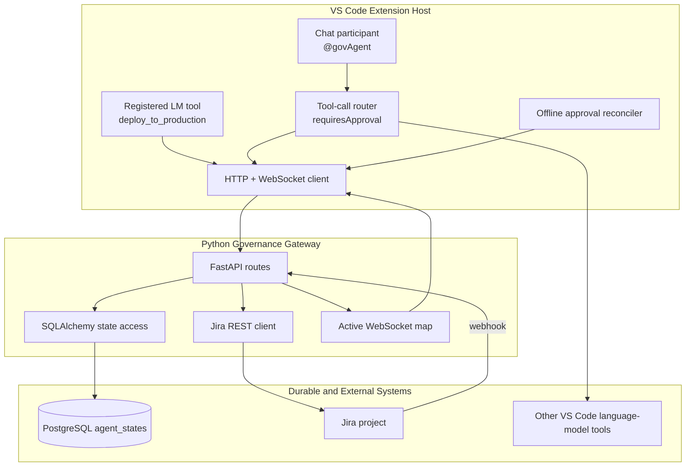
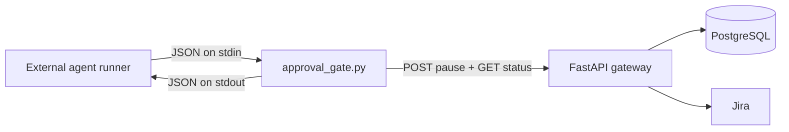

# Architecture

## Purpose

Agent-Gov places a human approval boundary in front of selected AI tool
calls. The action is represented as a checkpoint before it runs. A Jira issue
is the human decision surface, and PostgreSQL is the durable source used to
connect the Jira issue back to the paused tool call.

The code is a prototype with one Node-based VS Code extension and one Python
service. The extension does not run the database or Jira integrations itself;
it calls the Python gateway over HTTP and, while VS Code remains open, over a
WebSocket.

## Runtime Boundaries



There is a second, independent boundary for external agent runners:



The hook and extension share the gateway and state table, but they do not
share an in-process call stack. A hook-created approval is identified using
the external runner's session and tool-use identifiers. An extension-created
approval is identified using a deterministic hash.

## Component Responsibilities

### `src/extension.ts`

The extension is responsible for:

- registering the `deploy_to_production` language-model tool;
- registering the `@govAgent` chat participant;
- selecting a chat model and passing it the available VS Code tools;
- deciding which tool calls require approval;
- creating and storing the approval checkpoint through the gateway;
- waiting for Jira approval using WebSocket plus status polling;
- invoking the approved tool with `vscode.lm.invokeTool`;
- marking the checkpoint complete;
- detecting approvals that happened while VS Code was offline; and
- resuming approved checkpoints after a user sends `continue` to `@govAgent`.

The extension does not directly call Jira or PostgreSQL.

### `backendfiles for reading/main.py`

The gateway is responsible for:

- accepting pause requests;
- creating a Jira Task issue with the checkpoint payload;
- persisting the Jira key and checkpoint in PostgreSQL;
- returning approval status to polling clients;
- synchronizing status from Jira when a webhook is unavailable;
- forwarding webhook decisions to an active WebSocket; and
- marking a successfully resumed action as completed.

### `backendfiles for reading/database.py`

This module creates the SQLAlchemy engine and defines the `agent_states`
table. `init_db()` calls `Base.metadata.create_all`, so the table is created
at gateway startup if it does not already exist. There are no migrations in
the repository.

### `backendfiles for reading/hooks/approval_gate.py`

The hook is a dependency-free process intended to run before an external
agent tool call. It reads one JSON event, applies a watch-list policy, blocks
watched calls while Jira is pending, and emits one JSON permission decision.
Diagnostic messages go to stderr so stdout remains machine-readable.

### `package.json`, `esbuild.js`, and `tsconfig.json`

The Node project is a TypeScript VS Code extension. TypeScript is checked with
strict mode, ESLint runs over `src`, and esbuild bundles
`src/extension.ts` into `dist/extension.js`. The `vscode` module and selected
WebSocket native helpers remain external to the bundle.

## Tool Contributions

The manifest contributes:

| Contribution | Identifier | Behavior |
| --- | --- | --- |
| Activation event | `onLanguageModelTool:deploy_to_production` | Activates when the deployment tool is referenced. |
| Activation event | `onChatParticipant:agent-gov.participant` | Activates when `@govAgent` is used. |
| Chat participant | `agent-gov.participant` | Exposes the `govAgent` governance assistant. |
| Language-model tool | `deploy_to_production` | Requires `targetEnv` and `command` in its input schema. |
| Command contribution | `agentGovernance.executeRestrictedAction` | Declared in the manifest, but no matching `registerCommand` call exists in the current extension source. |

The chat participant can also see other tools exposed by the current VS Code
environment, including namespaced MCP tools. The extension only puts a
governance pause in front of the exact deployment tool and tool names whose
normalized suffix matches `transitionJiraIssue`.

## Approval Identity

### Extension identity

`getApprovalThreadId(toolName, input)` builds an identity from:

- the tool name;
- the tool input; and
- the first workspace path, or `default` if no workspace is open.

`stableSerialize()` sorts object keys recursively and preserves array order.
The identity is hashed with SHA-256, truncated to 32 hexadecimal characters,
and prefixed with `approval_`.

This makes repeated calls with the same tool, input, and workspace reuse the
same approval record. It also means the same logical deployment input can be
different across workspaces.

### Hook identity

The hook uses:

```text
<session_id>:<tool_use_id>
```

The `session_id` defaults to `unknown-session`; the `tool_use_id` falls back
to the current millisecond timestamp. This identity is not interchangeable
with the extension hash.

## Durable State Model

The SQLAlchemy model is `AgentExecutionState`:

| Column | Type | Role |
| --- | --- | --- |
| `thread_id` | String, primary key | Correlates the client, database row, and approval wait. |
| `jira_key` | String, nullable | Jira issue created for the checkpoint. |
| `status` | String, indexed | `PAUSED`, `APPROVED`, `REJECTED`, or `COMPLETED`. |
| `checkpoint_data` | JSON | Tool name, input, workspace/session data, and action metadata. |
| `created_at` | DateTime | Creation timestamp. |
| `updated_at` | DateTime | ORM update timestamp. |

The gateway's pause operation is idempotent by `thread_id`. If a row already
exists, the existing Jira key and current status are returned and a duplicate
Jira issue is not created.

## Network and Dependency Map

| Component | Default address | Talks to |
| --- | --- | --- |
| FastAPI gateway | `http://localhost:8000` | PostgreSQL, Jira, extension, hook |
| Gateway WebSocket | `ws://localhost:8000/api/v1/ws/{thread_id}` | Extension client |
| PostgreSQL | From `DATABASE_URL` | Gateway only |
| Jira | From `JIRA_BASE_URL` | Gateway REST client and configured webhook |
| VS Code extension | Extension Host process | VS Code Language Model API and gateway |

The extension URLs are hard-coded constants in `src/extension.ts`:
`http://localhost:8000` and `ws://localhost:8000`. The hook has a configurable
`GOVERNANCE_URL`, defaulting to the same gateway.