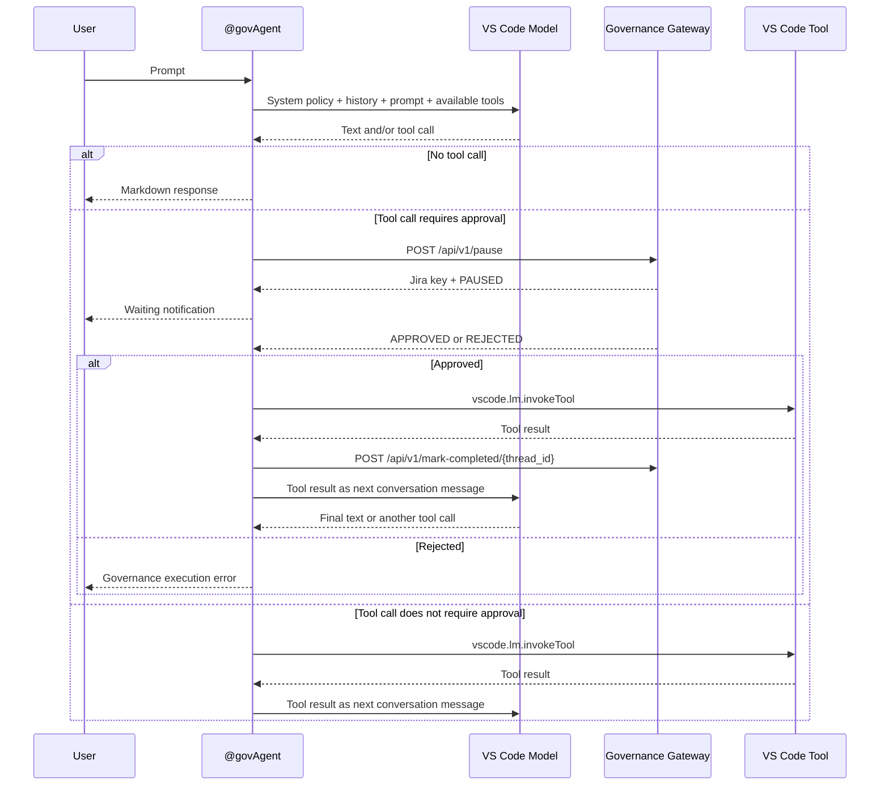
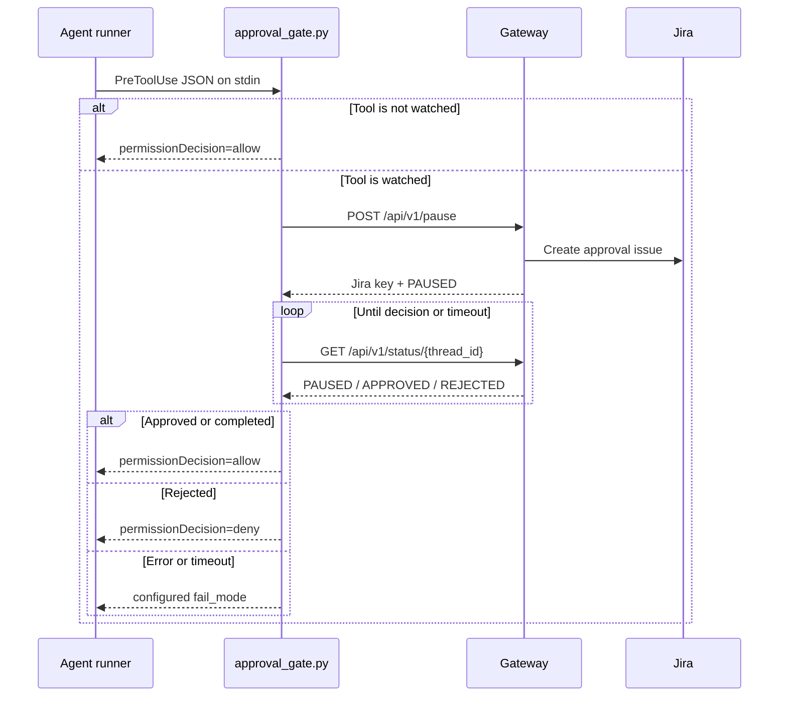

# Runtime Flows

## 1. Extension Activation

When VS Code activates the extension, `activate(context)` performs these
steps:

1. Logs an activation message.
2. Registers the `deploy_to_production` language-model tool.
3. Creates the `agent-gov.participant` chat participant.
4. Adds both disposables to `context.subscriptions`.
5. Starts an asynchronous offline-approval check immediately.
6. Starts another check every 10 seconds and registers disposal for that
   interval.

The offline check does not automatically invoke an approved action. It keeps
an in-memory status map and displays a notification telling the user to run
`@govAgent continue`.

## 2. Chat Request and Tool Loop

The chat participant is a model-tool orchestration loop. One user request can
cause several model responses and tool calls before the final text is shown.



The detailed algorithm is:

1. Report progress: `Analyzing request and evaluating security policy...`.
2. Use the request's model, or select the first available chat model.
3. If no model is available, write an error to the chat stream and stop.
4. Read the current `vscode.lm.tools` collection.
5. If the trimmed prompt is exactly `continue` (case-insensitive), recover
   approved jobs for the current workspace before sending the main request.
6. Build the model message list from the fixed governance policy, prior chat
   history, any recovery results, and the current prompt.
7. Send the messages with the available tools.
8. Collect streamed text, tool-call parts, and data parts.
9. If there are no tool calls, stream the accumulated text as Markdown and
   finish.
10. For each tool call, choose one of the three execution paths below.
11. Add each tool result to the conversation using its `callId`.
12. Send the assistant parts and tool results back to the model.
13. Repeat until the model returns text without a tool call.

The entire participant callback is wrapped in a catch block. Any thrown error
is logged and returned as a Markdown governance execution error.

## 3. Tool Classification

`requiresApproval(toolName)` applies two rules:

1. An exact name in `APPROVAL_REQUIRED_TOOLS` is governed. The current set
   contains `deploy_to_production`.
2. The tool name is normalized by removing non-alphanumeric characters and
   lowercasing it. A tool is governed if the normalized name ends with the
   normalized value of a name in `APPROVAL_REQUIRED_MCP_TOOL_BASE_NAMES`.
   The current set contains `transitionJiraIssue`.

The suffix rule allows namespaced tool names such as an MCP-qualified Jira
tool to match without hard-coding every namespace.

The router then applies this order:

| Condition | Action |
| --- | --- |
| Name is `deploy_to_production` | Call `handleDeployToProduction`. |
| Any other name requiring approval | Call `invokeGovernedTool`. |
| All other names | Call `vscode.lm.invokeTool` immediately. |

## 4. Deployment Tool Path

`handleDeployToProduction(input, token)` is the dedicated deployment flow.

1. Default `command` to `kubectl apply -f prod.yaml` when it is absent.
2. Default `targetEnv` to `production` when it is absent.
3. Derive a deterministic `approval_<hash>` thread ID.
4. Build a checkpoint containing the agent name, workspace, pending step,
   tool name, tool input, command, and target environment.
5. POST the checkpoint to `/api/v1/pause` with action type `DeployToolCall`.
6. Reject the request if the gateway reports `REJECTED`.
7. Return a duplicate-completion message if the gateway reports `COMPLETED`.
8. If the gateway reports `PAUSED`, show the Jira key and wait for approval.
9. Accept an already `APPROVED` result without waiting.
10. POST `/api/v1/mark-completed/{thread_id}`.
11. Return a success string containing the Jira key and command.

Important: the current implementation does not execute `command` as a shell
process. The deployment tool is a governance demonstration; after approval it
marks the checkpoint completed and reports the command. A real deployment
executor would need to be added behind the approved step.

## 5. Generic Governed Tool Path

`invokeGovernedTool(toolName, input, token, toolInvocationToken)` is used for
approved tools other than the dedicated deployment tool.

1. Build a deterministic thread ID from the tool and input.
2. Store a checkpoint with `tool_name` and `tool_input`.
3. POST `/api/v1/pause`.
4. Throw on `REJECTED`.
5. Return a completion result if the record is already `COMPLETED`.
6. Wait if the status is `PAUSED`.
7. Reject any unexpected status.
8. Invoke the approved tool with `vscode.lm.invokeTool`.
9. POST `/api/v1/mark-completed/{thread_id}`.
10. Return the real tool result to the model.

The `toolInvocationToken` is forwarded so VS Code can authorize the tool
invocation in the current chat turn.

## 6. Waiting for Jira

`listenOnWebSocket(threadId, token)` uses two delivery mechanisms:

- a WebSocket at `/api/v1/ws/{thread_id}` for immediate webhook events; and
- a GET poll to `/api/v1/status/{thread_id}` immediately and every 10 seconds.

The first approved or rejected result settles the promise. Cleanup clears the
poll interval, aborts the current fetch, disposes cancellation handling, and
closes the WebSocket. Cancellation rejects with `Tool execution cancelled`.

If the WebSocket errors or closes, the extension logs the event and keeps
polling. This allows approval to work when the live channel is unavailable.

On the server, the WebSocket route stores one connection in
`active_connections[thread_id]` and waits until the client disconnects. The
Jira webhook sends a JSON event to that connection when one exists.

## 7. Offline Approval Recovery

The extension periodically calls `/api/v1/pending-approvals`.

The background reconciliation path:

1. Reads all recoverable `PAUSED`, `APPROVED`, and `REJECTED` records.
2. Tracks the last observed state in `recoveryStatuses`.
3. Shows a notification only when a record changes state.
4. Removes records no longer returned by the gateway.

When the user sends exactly `continue` to `@govAgent`, the chat path performs
the actual resume:

1. Fetch recoverable jobs.
2. Keep approved jobs whose checkpoint workspace is the current workspace.
3. Reconstruct the tool from `checkpoint_data`.
4. Skip records without a complete tool checkpoint.
5. Invoke each approved tool once, guarded by `recoveryInProgress`.
6. Mark each job completed.
7. Add a plain-language result to the next model message.

The checkpoint reader first uses `tool_name` and `tool_input`. For the legacy
deployment shape it can derive the input from `action.command` and
`action.target_env`.

## 8. Standalone Hook Flow

The hook is a synchronous permission adapter for a separate agent runner.



The hook algorithm is:

1. Log invocation details to stderr.
2. Parse one JSON event from stdin. Invalid JSON returns `ask`.
3. Load defaults, then merge `hooks/approval_config.json` if present.
4. Let the `GOVERNANCE_URL` environment variable override the file value.
5. Read `tool_name`, `tool_input`, `session_id`, and `tool_use_id`.
6. Allow immediately if the tool does not match an exact or `fnmatch`
   wildcard in `watched_tools`.
7. Build `<session_id>:<tool_use_id>` and submit the checkpoint.
8. On server or pause errors, return the configured `fail_mode`.
9. Poll until `APPROVED`, `COMPLETED`, `REJECTED`, a missing record, or the
   deadline.
10. Return `allow`, `deny`, or the configured error/timeout mode.

The emitted shape is:

```json
{
  "hookSpecificOutput": {
    "hookEventName": "PreToolUse",
    "permissionDecision": "allow",
    "permissionDecisionReason": "Approved via Jira ABC-123."
  }
}
```

## 9. Jira Decision Propagation

There are two ways a paused state becomes a decision:

1. Jira sends a webhook to `/jira-webhook`. The gateway reads the status
   change from `changelog.items`, maps it, commits PostgreSQL, and sends a
   WebSocket event if the extension is connected.
2. A client calls `/status/{thread_id}` or `/pending-approvals`. If the row is
   still `PAUSED`, the gateway queries the Jira issue directly and applies the
   same status mapping.

Approval-like Jira statuses are `done`, `approved`, and `resolved`.
Rejection-like statuses are `rejected`, `closed`, and `declined`. All other
statuses leave the row paused.

## 10. Failure and Cancellation Behavior

| Situation | Extension behavior | Hook behavior |
| --- | --- | --- |
| Gateway unreachable while pausing | Throws and reports a governance error. | Returns `fail_mode`, default `ask`. |
| Jira decision is rejected | Does not invoke the tool. | Emits `deny`. |
| Status record is missing | Throws from the extension poll path. | Returns `fail_mode`. |
| WebSocket fails | Logs and continues HTTP polling. | Not used. |
| User cancels the request | Aborts wait and rejects the tool call. | No interactive cancellation; it waits or times out. |
| Approval timeout | The extension has no local deadline in `listenOnWebSocket`; it continues polling until cancellation or a decision. | Uses `max_wait_seconds`, default one hour. |