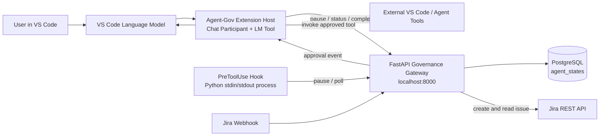

# Agent-Gov Documentation

Agent-Gov is a VS Code extension and Python governance gateway for pausing
high-impact AI tool calls until a human approves a Jira issue. The project
contains two related execution paths:

1. The VS Code extension governs chat-participant and language-model tool
   calls while the Extension Host is running.
2. The standalone `PreToolUse` hook governs tool calls made by an external
   agent runner by reading an event from standard input and returning a VS
   Code permission decision on standard output.

Both paths use the FastAPI gateway on port `8000`. The gateway stores the
checkpoint in PostgreSQL, creates the Jira approval issue, maps Jira status
changes to approval state, and exposes polling and WebSocket endpoints.

## Formulation CV

**Stagiaire R&D — Gouvernance des agents IA** · **Capgemini**

Projet de gouvernance des agents IA développé autour d’une extension VS Code,
avec utilisation d’Agno et de LangGraph.

## Documentation Map

- [Architecture](architecture.md): services, ownership boundaries, data model,
  identifiers, and dependencies.
- [Runtime Flows](flows.md): activation, chat turns, tool calls, approvals,
  recovery, WebSockets, and the standalone hook process.
- [Backend API](backend.md): FastAPI startup, PostgreSQL persistence, Jira
  integration, endpoints, request shapes, and state transitions.
- [Development and Operations](development.md): installation, configuration,
  local startup, build scripts, testing, and debugging.
- [Limitations and Security](limitations.md): current behavior, prototype
  constraints, security concerns, and source-level gaps.

## System at a Glance

## Approval State Lifecycle

| State | Meaning | Who writes it |
| --- | --- | --- |
| `PAUSED` | A checkpoint exists and its Jira issue is waiting for a human decision. | `POST /api/v1/pause` |
| `APPROVED` | Jira has moved to an approval-like status. | Jira webhook or status synchronization |
| `REJECTED` | Jira has moved to a rejection-like status. | Jira webhook or status synchronization |
| `COMPLETED` | The approved tool call has been invoked successfully by the extension, or has been accepted by the caller. | `POST /api/v1/mark-completed/{thread_id}` |

The extension treats `APPROVED` as permission to invoke a tool and then moves
the record to `COMPLETED`. The hook treats both `APPROVED` and `COMPLETED` as
an allow decision. A rejection is never invoked.

## Source Map

| Area | Source |
| --- | --- |
| Extension manifest, activation events, contributions, and npm scripts | [`package.json`](../package.json) |
| Extension activation, chat loop, tool routing, approval waiting, and recovery | [`src/extension.ts`](../src/extension.ts) |
| Extension integration-test entry point | [`src/test/extension.test.ts`](../src/test/extension.test.ts) |
| FastAPI gateway and Jira integration | [`backendfiles for reading/main.py`](../backendfiles%20for%20reading/main.py) |
| SQLAlchemy engine and `agent_states` model | [`backendfiles for reading/database.py`](../backendfiles%20for%20reading/database.py) |
| Standalone `PreToolUse` hook | [`backendfiles for reading/hooks/approval_gate.py`](../backendfiles%20for%20reading/hooks/approval_gate.py) |
| TypeScript compiler settings | [`tsconfig.json`](../tsconfig.json) |
| esbuild bundle configuration | [`esbuild.js`](../esbuild.js) |
| VS Code debug and watch configuration | [`.vscode/launch.json`](../.vscode/launch.json), [`.vscode/tasks.json`](../.vscode/tasks.json) |

## Quick Local Run

The project currently has no Python dependency file or hook configuration
file checked in. A local run therefore requires the following preparation:

1. Create a PostgreSQL database and set `DATABASE_URL`, or use the default
   URL in `backendfiles for reading/database.py`.
2. Install the Python packages imported by the gateway: `fastapi`, `uvicorn`,
   `sqlalchemy`, `requests`, `python-dotenv`, and `pydantic`.
3. Set `JIRA_BASE_URL`, `JIRA_EMAIL`, `JIRA_API_TOKEN`, and
   `JIRA_PROJECT_KEY` for Jira issue creation and status synchronization.
4. Run `main.py` from `backendfiles for reading/`; it listens on
   `http://localhost:8000`.
5. Run `npm install`, then `npm run compile` or press `F5` to launch the
   extension development host.
6. Configure the standalone hook separately if external agent calls should be
   governed. Its default `watched_tools` list is empty, so no tools are
   watched until a configuration file or integration supplies patterns.

For the complete commands and configuration details, see
[Development and Operations](development.md).